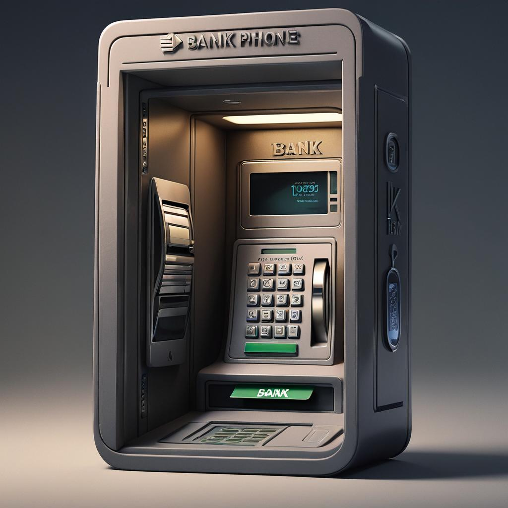

# Immutable Bank



What if?

- What if a bank could run almost entirely within a phone?
- What if the state was fully immutable and hence can not be destroyed?
- What if rebuilding the bank from scratch is easier then trying to fix it?

Immutability Superpowers!!!

# Getting Started

## Running native

```sh
rustup update
sudo apt-get install libxcb-render0-dev libxcb-shape0-dev libxcb-xfixes0-dev libxkbcommon-dev libssl-dev
cargo run --release
```

## Running web (local)

```sh
rustup target add wasm32-unknown-unknown
cargo install --locked trunk
trunk serve
```

Open http://127.0.0.1:8080/index.html#dev
Press ctrl-F5 to refresh

## Deploying

```sh
trunk build --release
cp -r -f dist /your/target/web/server
```
